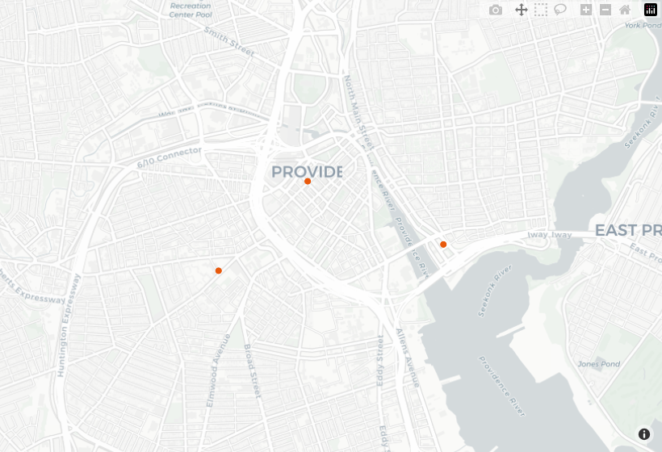

---
output:
  github_document:
    md_extensions: -smart
---

<!-- README.md is generated from README.Rmd. Edit the .Rmd, then run
     devtools::build_readme() (with CLOSECITY_KEY set to render live output). -->

```{r, include = FALSE}
knitr::opts_chunk$set(collapse = TRUE, comment = "#>", fig.path = "man/figures/README-",
                      eval = nzchar(Sys.getenv("CLOSECITY_KEY")))
library(closecity)
library(sf)
close <- close_client(Sys.getenv("CLOSECITY_KEY"))
```

# closecity 

R client for the Close API. Get travel times from every US census block to nearby
places, on foot, by bike, and by public transit. This is the data behind
[close.city](https://close.city), read over the [Close API](https://api.close.city).

**Documentation:** <https://henryspatialanalysis.github.io/closecity-r/>

## Install

```r
# install.packages("remotes")
remotes::install_github("henryspatialanalysis/closecity-r")
```

## A first call

You make requests through a client object. Feature results come back as
[sf](https://r-spatial.github.io/sf/) objects, so you can map them right away.

```r
library(closecity)
# The key (ck_live_) comes from https://account.close.city (5,000 free tokens,
# no card). Or set the CLOSECITY_KEY environment variable and call
# close_client() with no argument.
close <- closecity::close_client(api_key = "ck_live_your_key")   # use your own key here
```

`close_map()` draws any result on an interactive CARTO Positron basemap in one line —
bright hoverable points, or blocks shaded by travel time, zoomed to the data. (The
image below is a snapshot; in a session or the [tutorials](https://henryspatialanalysis.github.io/closecity-r/articles/)
the map is live and pannable.)

```{r first-call, eval = FALSE}
# Supermarkets within a 1.5 km walk of a point (type 30 is grocery stores):
supermarkets <- close$pois_search(lat = 41.823, lon = -71.412, radius_m = 1500, type = 30)
closecity::close_map(x = supermarkets, color = "#e8590c", label = "name")
```



Catalog and lookup routes are free and need no key:

```{r}
close$modes()                       # walk, bike, transit
close$places(q = "Providence")      # a city name to its GEOID and centre
```

## Key terms

- **Census block.** The smallest area the Census Bureau publishes. Each one has a
  15-digit id called a **GEOID**.
- **Destination type.** A category of place, such as grocery stores or libraries.
  Each type has a numeric id. Look them up with `close$destination_types()`.
- **Mode.** How someone travels: walk, bike, or transit.
- **Isochrone** or **catchment**: the area you can reach starting from a point within
  a time limit, by a selected travel mode.

## Choosing an output

Set `output` on the client, or per call:

- `output = "spatial"` (the default) returns an `sf` object where geometry applies
  and a `data.frame` otherwise. Block routes join census-block boundaries with the
  `tigris` package, downloaded once and cached.
- `output = "tabular"` returns a `data.frame` for every route and never downloads
  boundaries. Reach for it when you only want the numbers.
- `output = "raw"` returns the underlying `close_reply`, with the parsed body on
  `$data` and the token counts alongside.

```{r}
close$output <- "raw"
reply <- close$block_summary(geoid = "440070008001068", mode = "walk")
str(reply$results, max.level = 2, list.len = 3)
```

## Handling errors

Failed requests raise a classed condition. Catch the base `close_api_error`, or a
specific one such as `close_api_tokens_exhausted`.

```{r}
tryCatch(
  close$block_summary(geoid = "000000000000000"),
  close_api_error = function(e) message(sprintf("%s (%d)", e$slug, e$status))
)
```

The client does not retry automatically. On a rate-limit or service-unavailable
error, wait `e$retry_after` seconds (from the `Retry-After` header) and retry the
request yourself.

## Reference

- Package documentation: <https://henryspatialanalysis.github.io/closecity-r/>
- API docs and guides: <https://docs.close.city>
- Interactive API: <https://api.close.city/docs>
- Machine-readable contract: <https://api.close.city/openapi.json>
