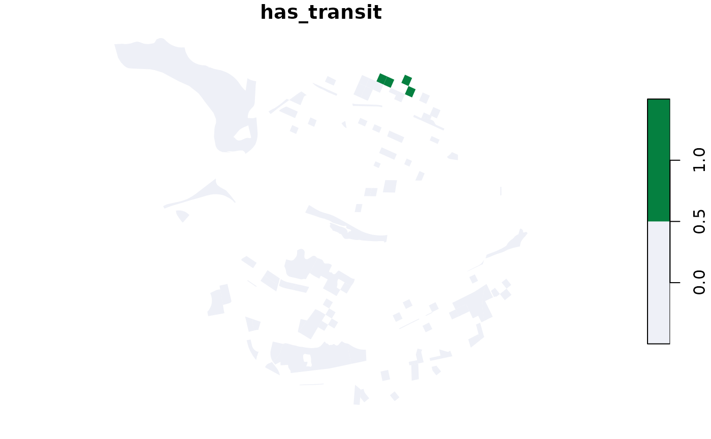
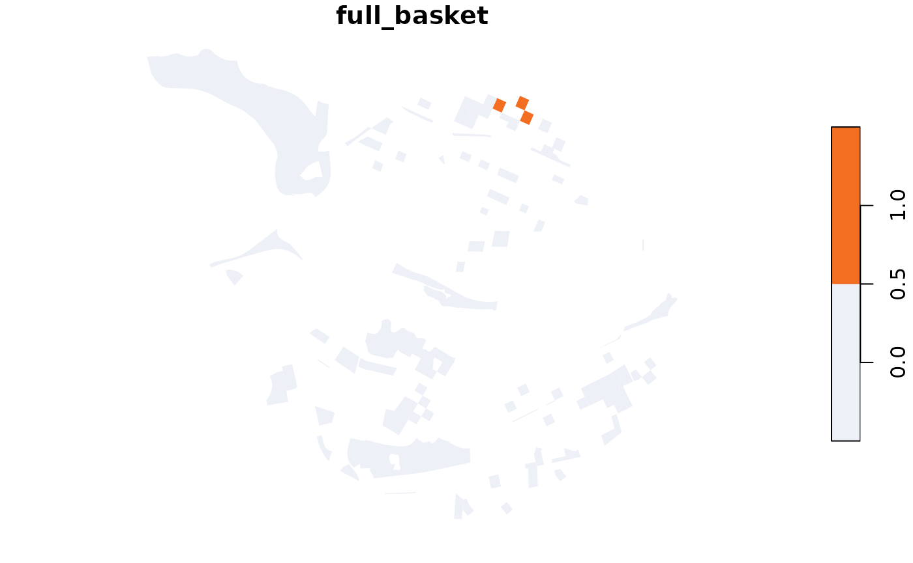
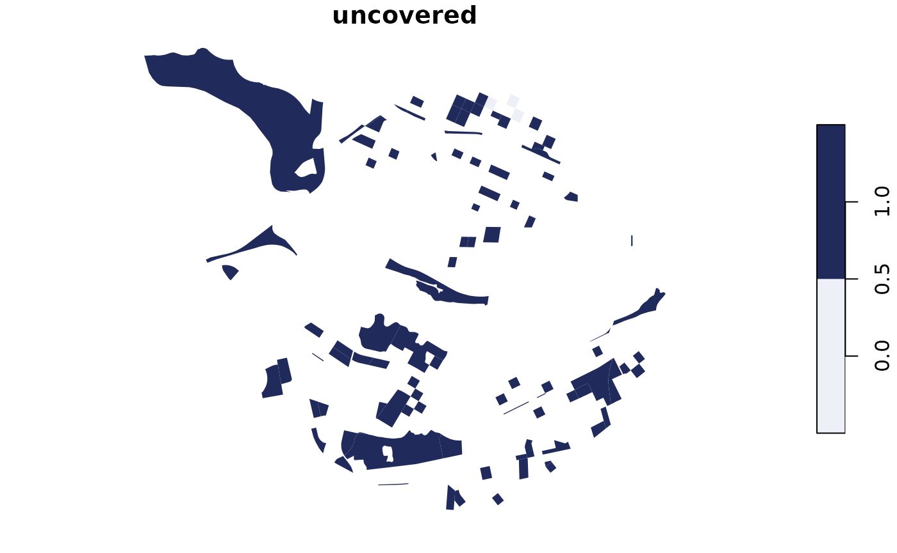

# The amenity basket

A city planner wants every resident to be able to walk to a basket of
six everyday amenities: a grocery store, a library, a park, a
frequent-transit stop, a restaurant, and a cafe. This tutorial measures
how many residents already have that, and shows where the gaps are. The
idea follows [this
analysis](https://nathenry.com/writing/2023-02-07-seattle-walkability.html),
here applied to Richmond, Virginia.

## Set up

Read the six category ids from the free catalog, and turn the city name
into a centre point.

``` r

library(closecity)
library(sf)
close <- close_client("ck_live_your_key")   # use your own key here
```

``` r

types <- close$destination_types()$data$destination_types
labels <- sapply(types, `[[`, "label")
ids <- sapply(types, `[[`, "dest_type_id")

basket <- c(
  grocery = ids[labels == "grocery_stores"],
  library = ids[labels == "libraries"],
  park = ids[labels == "parks"],
  transit = ids[labels == "frequent_transit"],
  restaurant = ids[labels == "restaurants"],
  cafe = ids[labels == "cafes"]
)

city <- close$places("Richmond")$data$places[[1]]
```

## Pull the blocks, with population

One call gets the walk time from every block near downtown to each of
the six categories, along with each block’s population. The result is an
sf table.

``` r

blocks <- close$blocks_query(
  center = list(lon = city$lon, lat = city$lat), radius_m = 2500,
  mode = "walk", type = unname(basket), include_population = TRUE
)

# One row per block, for population and for mapping.
one_per_block <- blocks[!duplicated(blocks$geoid), ]
total_pop <- sum(one_per_block$population)
```

## Coverage, one amenity at a time

For each amenity, a block counts as covered when it is within a
15-minute walk. Add up the population of the covered blocks.

``` r

for (name in names(basket)) {
  covered <- unique(blocks$geoid[blocks$dest_type_id == basket[name] &
                                   blocks$travel_time <= 15])
  pop <- sum(one_per_block$population[one_per_block$geoid %in% covered])
  cat(sprintf("%-11s %3.0f%%\n", name, 100 * pop / total_pop))
}
#> grocery      10%
#> library      38%
#> park         88%
#> transit       6%
#> restaurant   58%
#> cafe         52%
```

Parks and restaurants tend to be everywhere; groceries and frequent
transit are usually the hardest to reach. Map one amenity to see the
pattern.

``` r

near_transit <- unique(blocks$geoid[blocks$dest_type_id == basket["transit"] &
                                      blocks$travel_time <= 15])
one_per_block$has_transit <- one_per_block$geoid %in% near_transit

plot(one_per_block["has_transit"], pal = c("#eef0f7", "#058040"), border = NA)
```



## Who can reach all six

A block is fully covered only if all six amenities are within 15
minutes. Start with every block and remove the ones that miss any
amenity.

``` r

covered_all <- one_per_block$geoid
for (name in names(basket)) {
  covered <- unique(blocks$geoid[blocks$dest_type_id == basket[name] &
                                   blocks$travel_time <= 15])
  covered_all <- intersect(covered_all, covered)
}

basket_pop <- sum(one_per_block$population[one_per_block$geoid %in% covered_all])
cat(sprintf("All six amenities: %.0f%% of residents\n", 100 * basket_pop / total_pop))
#> All six amenities: 5% of residents

one_per_block$full_basket <- one_per_block$geoid %in% covered_all
plot(one_per_block["full_basket"], pal = c("#eef0f7", "#f36e21"), border = NA)
```



## Which amenity to add first

Look at the residents who are not yet fully covered, and count how many
of them are missing each amenity. The amenity that the most people lack
is the one to add first.

``` r

uncovered <- setdiff(one_per_block$geoid, covered_all)

for (name in names(basket)) {
  covered <- unique(blocks$geoid[blocks$dest_type_id == basket[name] &
                                   blocks$travel_time <= 15])
  lacking <- setdiff(uncovered, covered)
  pop <- sum(one_per_block$population[one_per_block$geoid %in% lacking])
  cat(sprintf("%-11s %6.0f residents would gain access\n", name, pop))
}
#> grocery       5301 residents would gain access
#> library       3669 residents would gain access
#> park           721 residents would gain access
#> transit       5565 residents would gain access
#> restaurant    2493 residents would gain access
#> cafe          2809 residents would gain access
```

Map the uncovered blocks to see where new amenities would do the most
good.

``` r

one_per_block$uncovered <- one_per_block$geoid %in% uncovered
plot(one_per_block["uncovered"], pal = c("#eef0f7", "#202a5b"), border = NA)
```


