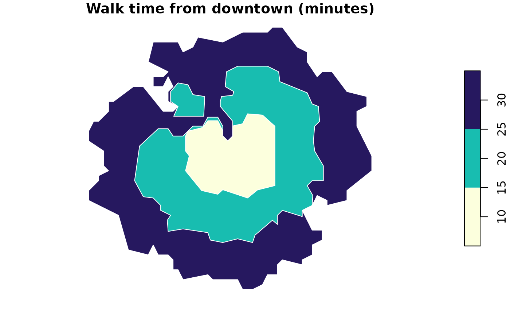
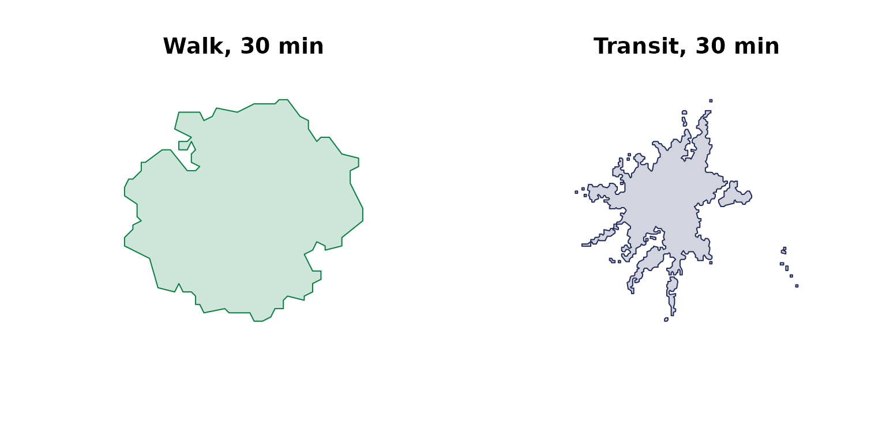

# Your first walkability map

The quickest way to feel what Close gives you: read one block’s travel
times, map the groceries around it, then draw how far you can walk from
it. The example city is Providence, Rhode Island.

*Running this tutorial uses about 90 tokens.*

## Set up

Build a client, then read what you need from the free catalog.

``` r

library(closecity)
library(sf)
close <- close_client("ck_live_your_key")   # use your own key here
```

``` r

types <- close$destination_types()
grocery <- types$dest_type_id[types$label == "grocery_stores"]

downtown <- close$places("Providence")[1, ]
```

## Read one block’s travel times

Pick a block and ask how long it takes to walk to each kind of amenity.
The result is a small data frame, one row per category.

``` r

summary <- close$block_summary("440070008001068", mode = "walk")
summary[, c("dest_type_id", "travel_time")]
#>    dest_type_id travel_time
#> 1             1          10
#> 2             5          26
#> 3             6          22
#> 4             7          10
#> 5            27           3
#> 6            28           3
#> 7            29           9
#> 8            30           6
#> 9            31           3
#> 10           32          15
#> 11           33          18
#> 12           34           9
#> 13           35          13
#> 14           38          17
#> 15           40           8
#> 16           41           9
#> 17           43           3
#> 18           60           2
#> 19           63           3
#> 20           64           4
#> 21           65           7
#> 22           66          13
#> 23           67           3
#> 24          126          10
#> 25          159          14
#> 26          160          24
#> 27          200           2
#> 28          204           2
#> 29          205           2
#> 30          206           4
#> 31          207           7
#> 32          208           3
#> 33          209           9
```

## Map the groceries nearby

A radius search returns points, ready to map.

``` r

groceries <- close$pois_search(lat = downtown$lat, lon = downtown$lon,
                               radius_m = 1200, type = grocery)
plot(st_geometry(groceries), pch = 19, col = "#058040")
```


## Draw how far you can walk

An isochrone is the headline map: the area you can reach on foot in 10,
20, and 30 minutes. The contours come back largest first, so drawing
them paints the nearer times on top.

``` r

rings <- close$isochrone(block = "440070008001068", mode = "walk",
                         direction = "from", contours = c(10, 20, 30))
plot(rings["contour"], pal = hcl.colors(3, "YlGnBu", rev = TRUE),
     border = "white", main = "Walk time from downtown (minutes)")
```



## Walk versus transit

The same block, the same 30-minute budget, two modes side by side. It is
the clearest way to see what the bus buys you.

``` r

walk <- close$isochrone(block = "440070008001068", mode = "walk",
                        direction = "from", minutes = 30)
transit <- close$isochrone(block = "440070008001068", mode = "transit",
                           direction = "from", minutes = 30)

par(mfrow = c(1, 2))
plot(st_geometry(walk), col = "#05804033", border = "#058040",
     main = "Walk, 30 min")
plot(st_geometry(transit), col = "#202a5b33", border = "#202a5b",
     main = "Transit, 30 min")
```



## Where to next

- **Looking for a home**: find blocks near several amenities at once,
  then narrow to a commute.
- **The amenity basket**: population-weighted walkability coverage
  across a whole city.
- **Competitor walksheds**: who else draws from your neighbourhood.
